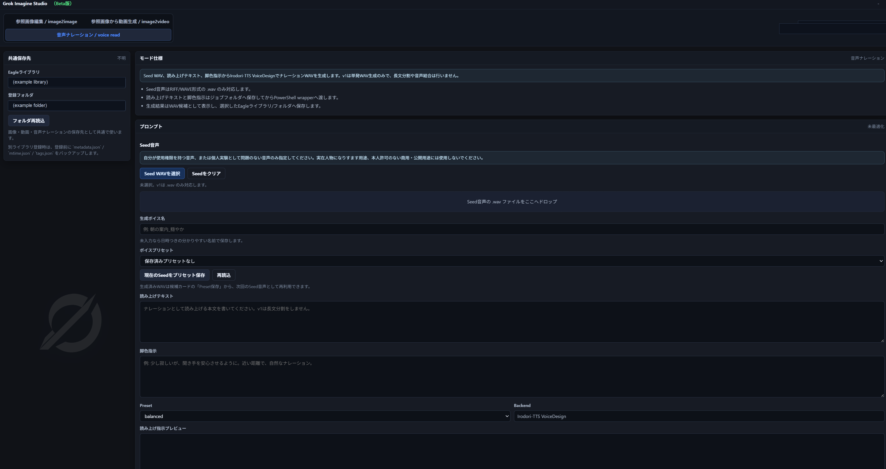

# Eagle Grok Imagine Studio

Language:
[Japanese](README.md) | [English](README.en.md) | [Simplified Chinese](README.zh-CN.md)

<!-- section:overview -->
## 概览

Eagle Grok Imagine Studio 是一个个人制作的 Eagle 4.0 插件，用于把 Eagle 中的参考图片整理成提示词，并交给 Grok CLI / Grok Build 做图片或视频生成。

这是开发中的首个公开调试版本，不是面向插件商店的成熟版本，需要用户在本地自行测试和调整。

这个公开版本不包含作者的 Grok 登录状态、本地设置、本地路径、生成媒体或工作日志。用户需要在自己的环境中配置 Grok CLI。



<!-- section:audience -->
## 适用用户

- 使用 Eagle 管理图片/视频生成素材的用户。
- 能在自己的环境中配置 Grok CLI / Grok Build 的用户。
- 想先用小型测试资料库验证，并可让 Codex 或其他 AI 代理协助调整本地设置的用户。
- 理解这是首个调试版本，并能在查看日志和结果的前提下自行承担测试风险的用户。

<!-- section:features -->
## 功能

- 使用 Eagle 中选中的项目或拖入的图片作为有序参考。
- 在提示词中保留 `@1`、`@2`、`@3` 等参考标记。
- 提供图片编辑、参考图生成视频、辅助旁白等工作界面。
- 可通过 Grok CLI / Grok Build 尝试提示词优化和生成。
- 可使用 Eagle AI SDK 的默认聊天模型做本地提示词优化。
- 可将生成结果登记到当前或指定的 Eagle 资料库。
- 可在可用时使用 FFmpeg/FFprobe 辅助缩略图和视频处理。

<!-- section:requirements -->
## 前提条件

- [Eagle](https://jp.eagle.cool/) 4.0 或更高版本。
- 可运行 Eagle Plugin API 插件的环境。Eagle Plugin API 支持 Web 技术、Node.js API 和 Eagle 内部文件/文件夹操作。
- Grok CLI / Grok Build。推荐让 `grok` 可从 PATH 启动。
- FFmpeg / FFprobe。推荐让 `ffmpeg` 和 `ffprobe` 可从 PATH 启动。
- 可选: [Aratako/Irodori-TTS](https://github.com/Aratako/Irodori-TTS)，仅在使用旁白辅助时需要。
- 可选: [Eagle 浏览器扩展](https://jp.eagle.cool/extensions)，这是用于收集网页素材的独立工具。

Irodori-TTS 集成会引用用户自己的本地 checkout。本项目不包含模型权重、参考音频或个人设置。

<!-- section:installation -->
## 安装

1. 获取此仓库。
2. 将此文件夹放入 Eagle 插件目录。
3. 重启 Eagle，并在插件列表中打开 `Grok Imagine Studio`。
4. 确认 Grok CLI、FFmpeg 以及可选的 Irodori-TTS 可通过 PATH 或环境变量访问。

不要直接公开带有原始历史的私人工作仓库。公开发布时，应从不含私人历史的净化候选目录创建新的公开仓库。

### 快速开始

```powershell
git clone <PUBLIC_REPO_URL>
cd eagle-grok-imagine-studio

# 如果这些工具已经在 PATH 中，保持这些默认值即可。
$env:GROK_CLI_COMMAND="grok"
$env:FFMPEG_PATH="ffmpeg"
$env:FFPROBE_PATH="ffprobe"

node .\scripts\smoke-ui.js
node .\scripts\smoke-runprocess.js
```

首次安装时，建议把本 README 和 `public_config_requirements.md` 交给 Codex，让它根据你的本地环境引导安装和配置调整。请让 Codex 引用你自己的 Grok CLI、FFmpeg 和 Eagle AI SDK 模型环境。本插件本身不需要额外添加 API key。

在 Eagle 中使用时，请将此文件夹放入 Eagle 插件目录，重启 Eagle，并先用一个小型测试资料库打开。第一次运行建议先确认参考图片读取和提示词生成，再执行真实生成。

<!-- section:configuration -->
## 配置

公开版默认值不使用任何特定用户的路径。

- Grok CLI: 默认命令为 `grok`，请确保它可从 PATH 解析，或设置 `GROK_CLI_COMMAND`。
- FFmpeg / FFprobe: 默认值为 `ffmpeg` / `ffprobe`，需要时可设置 `FFMPEG_PATH` / `FFPROBE_PATH`。
- Upscayl: 可选功能；使用图片放大时可设置 `UPSCAYL_BIN` / `UPSCAYL_MODELS`。
- Eagle 目标: 插件优先使用启动它的当前 Eagle 资料库。
- 本地 LLM: 插件使用 Eagle AI SDK 的默认聊天模型。如果让 Codex 或其他 AI 代理调整设置，请让它引用你自己的 Eagle 环境中的模型。
- Irodori-TTS: 将 `IRODORI_TTS_ROOT` 指向 Irodori-TTS checkout，或将 `IRODORI_VOICE_READ_RUNNER` 指向兼容的包装脚本。

此插件本身不需要 `XAI_API_KEY` 等 API key。Grok 集成会调用用户自己已登录/配置好的 Grok CLI / Grok Build 环境，并不实现直接 xAI API 调用。

参见 [public_config_requirements.md](public_config_requirements.md)、[.env.example](.env.example) 和 [config.example.json](config.example.json)。

<!-- section:usage -->
## 使用方法

1. 在 Eagle 中选择参考图片并打开插件。
2. 如有需要，拖放更多图片。
3. 选择图片、视频或语音模式。
4. 输入意图或演出说明，然后生成或优化提示词。
5. 运行 Grok Build 并检查结果卡片。
6. 选择 Eagle 资料库/文件夹并登记结果。

Grok 生成会在用户自己的 Grok 环境中执行。次数限制和使用条件取决于用户自己的账号及 Grok 当前行为。

<!-- section:troubleshooting -->
## 故障排查

- 找不到 Grok: 在终端确认 `grok --version` 可运行。
- 找不到 FFmpeg: 确认 `ffmpeg -version` 和 `ffprobe -version`。
- 没有 Eagle 目标: 在已加载资料库的 Eagle 内打开插件。
- Irodori-TTS 失败: 确认 `IRODORI_TTS_ROOT` 指向包含 `infer.py` 的文件夹。
- 未检测到生成媒体: 检查插件临时输出、Downloads 和 Grok 输出位置。

不消耗生成次数的本地测试:

```powershell
node .\scripts\smoke-moderation.js
node .\scripts\smoke-runprocess.js
node .\scripts\smoke-ui.js
node .\scripts\smoke-eagle-runtime.js
```

<!-- section:not-included -->
## 不包含的内容

- Grok 登录/会话数据或个人设置。
- 直接 xAI/Grok API 调用或计费流程。
- 作者的本地路径、Eagle 资料库、工作日志或生成媒体。
- Irodori-TTS 源码树、模型权重或参考音频。
- Eagle 本体、Eagle 浏览器扩展、Grok CLI 或 FFmpeg。

<!-- section:security-privacy -->
## 安全 / 隐私说明

此插件会把用户参考素材复制到本地临时文件夹，并把任务交给 Grok CLI 和 Eagle API。运行 Grok 生成时，提示词和参考信息会在用户自己的 Grok 环境中处理。

请不要提交 `.env`、真实日志、生成媒体、Eagle 资料库、个人设置或工作笔记。

<!-- section:license -->
## 许可证

本仓库中的插件代码和文档以 [MIT License](LICENSE) 发布。

MIT License 只适用于本仓库包含的代码和文档。它不替代 Grok、Eagle、FFmpeg、Upscayl、Irodori-TTS、模型、服务或外部二进制文件各自的使用条款。

<!-- section:attribution -->
## 致谢

- 请参考官方 [Eagle](https://jp.eagle.cool/) 和 [Eagle Plugin API](https://developer.eagle.cool/plugin-api/) 文档。
- [Aratako/Irodori-TTS](https://github.com/Aratako/Irodori-TTS) 是公开的 MIT 许可 TTS 项目。使用旁白功能前，请确认其许可证和模型卡。
- Grok / xAI 相关使用条件以用户自己的环境为准。
- FFmpeg / FFprobe、Upscayl 和 Eagle 浏览器扩展不随本项目分发。用户需要自行安装，并遵守各自的许可证和使用条款。
- 详情请参见 [THIRD_PARTY_NOTICES.md](THIRD_PARTY_NOTICES.md)。

<!-- section:disclaimer -->
## 免责声明

本项目是用于个人兴趣、学习和本地测试的实验性首个调试版本，按原样提供，不作任何保证。作者不对生成结果、外部服务变化、使用限制、数据处理或 Eagle 资料库登记结果负责。

这是非官方的个人项目，并非 Eagle、xAI/Grok、FFmpeg、Upscayl 或 Aratako/Irodori-TTS 的官方项目，也不代表它们的认可、赞助或合作关系。在重要 Eagle 资料库中使用前，请先备份并用少量样本测试。
